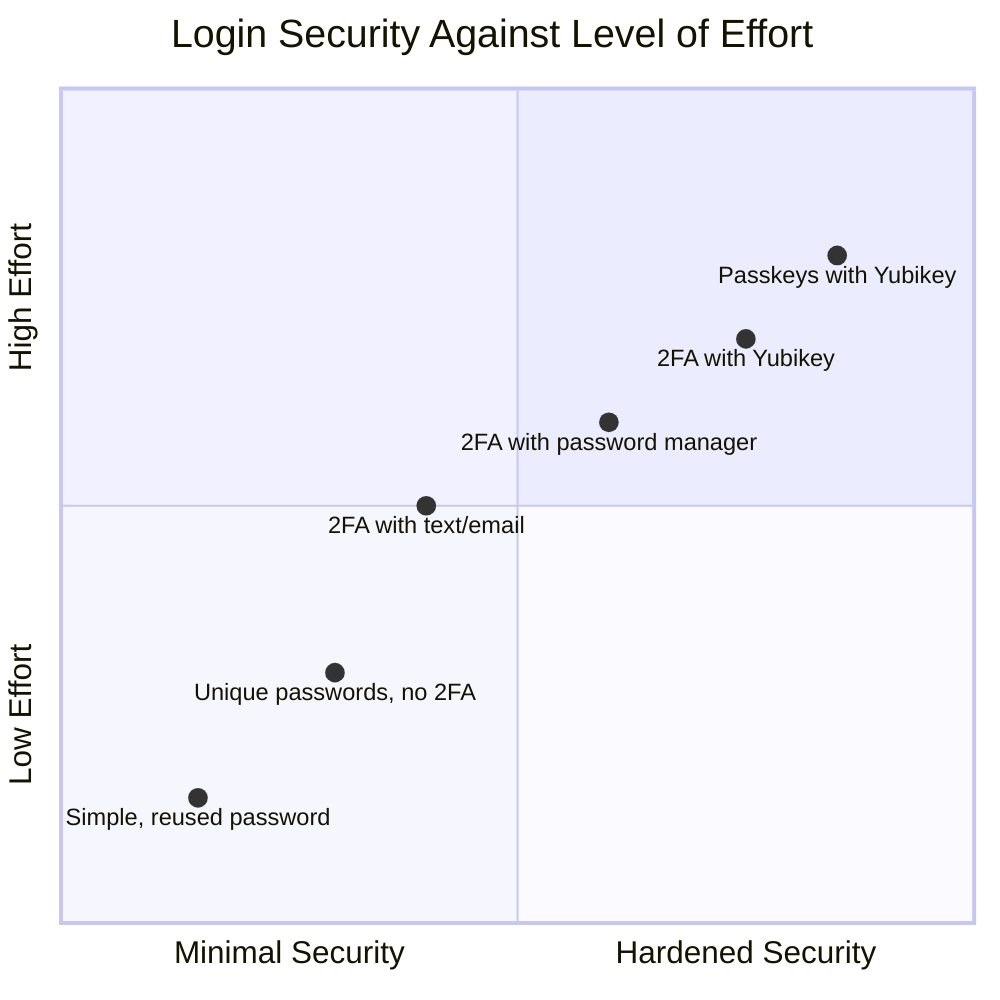

The information security space can feel overwhelming. Which forms of 2 factor authentication are more secure? How does that tie into password management? What are these passkeys that are coming up in more services? My OS allows me to take advantage of this in their system. Why would I want to consider a 3rd party solution?

This post is the first in a series of [approachable privacy and security](/series/approachable-privacy-and-security) with the goal of breaking down different topics and tools to consider which ones may be helpful to people's personal lives. It makes sense why businesses would stress the importance of good security—the [average cost](https://www.forbes.com/advisor/education/it-and-tech/cybersecurity-statistics/) of a data breach in 2024 was $4.88 million.

At a personal level we may ascribe to _having nothing to hide_ or why would someone want to attack me. There are so many answers to that which could be a whole post in itself. I'll provide one example for the time being. In a world where we have been desensitized to giving away our privacy, we risk being unaware of ways it can be maliciously used both by corporations and bad actors. Earlier this month, Futurism [published an article](https://futurism.com/facebook-beauty-targeted-ads) on how Facebook allegedly detected moments of "psychological vulnerability" where it could capitalize on selling ads to unethically manipulate teen girls. In my last post, I shared concerns about [engaging in the ethics of systems design and exclusion](/blog/who-are-we-excluding-in-our-systems-designs/).

Before diving in further, I have a set of quick disclaimers and context to share:

* I am not a privacy or security expert. I'm an AuDHD woman who has spent the past several months reviewing and overhauling a lot of personal infosec and opsec practices.
* My goal for this series is to balance the technical details with making things approachable to those with less technical background. Gatekeeping is only another form of exclusion.
* Elitism serves no one. Any steps towards increased privacy are good ones. People have different needs and concerns. Something may feel overboard now. That's ok. It's also ok if that changes in the future. Regaining our agency is not a one-time action.
* I will again shout out Michael Bazzell's book _Extreme Privacy: What it Takes to Disappear_ as a fantastic means to dive deeper into privacy concerns in an approachable way.
* I have no affiliation with any of the companies, products, or services mentioned. I have not been compensated in any manner. I have purchased and experimented with these resources with my own money.

## Definition of Terms

In the spirit of increasing the approachability of the topic, this section includes a high level definition of terms that will be referenced throughout this article. If this is overwhelming, feel free to revisit the section throughout the rest of the post as different pieces are discussed. If you are already familiar with many of these topics a quick skim through of this section may be more than sufficient.

* **Information Security (infosec):** Infosec is the broad label applied to processes, tools, etc to help protect access to information. This includes what information is available, to whom, and the means to protect the access of that information to those who need it.
* **Operational Security (opsec):** Opsec is more focused on logistics, items that could impact or jeopardize physical safety, etc. This concern often runs parallel to infosec, but they are distinct concerns. An example of this interplay is geolocation data. Determining who to share this data with and how it is protected is infosec. Opsec captures the reasons why we may want reduced access or even disable features due to concerns of surveillance, stalking, and safety.
* **2/multi factor authentication (2FA/MFA):** 2FA is requiring something that someone **has** in addition to something they **know** to gain access. If your email does not have 2FA enabled and your password gets compromised, is shared, etc an attacker can log in and change the password. 2FA may require a text, email, or use of an app to provide a code as part of the authentication process. If an attacker doesn't have access to that, gaining control is more difficult. The medium of getting and using the 2FA codes have various means of security. MFA can be synonymous with 2FA, or can require more than 2 forms of authentication and sensitivity around access.
* **Time-Based One-Time Password (TOTP):** These are the often 6 digit codes that get used once and have a short term lifespan. These are the most common means of implementing 2FA, though they are not the only ones.
* **Passkeys:** Passkeys are becoming increasingly popular and further increase security. These utilize public key cryptography where the server of a service stores a key which is associated with your identity. You provide a private key that matches up to the server key to confirm authorization. These can be stored via OS (eg Apple Passwords), password managers, and hardware keys. They have increased security since a password isn't exchanged (even if a short lived one like TOTP).
* **Hardware Key:** TOTP codes and passkeys can be stored in an app that is available on your various devices. They can be stored in Password managers. Many of these solutions can sync across your devices for ease of use. Those services implement their own security to reduce risk of unauthorized access, but they are still often stored online. These services are not immune from data breaches as exemplified by a large breach with [Lastpass in 2022](https://blog.lastpass.com/posts/notice-of-recent-security-incident). Hardware keys store this information on a physical device removing the constant internet connectivity from the equation.
* **Yubikey:** [Yubikeys](https://www.yubico.com) are a specific example of a hardware key by a company called Yubico. They are an industry leader providing multiple products depending on needs.
* **Authentication:** Is the means of verifying the identity of a user. 
* **Authorization:** Is the means of determining that a user has the appropriate permissions. Is the user an admin of a service? What data do they have access to? An example could be a to-do manager. I may be authorized to see all of my own personal to-dos. However, I may also share a project with a friend where we both can see and edit to-dos within that project.

## Layers of Security

That was a ton of terms and may have been a bit overwhelming. Again, please refer back to the section above as needed. Security is often about finding the right balance between the inconvenience of increased security and the desire to protect unauthorized access to information. Thankfully, there are a growing number of tools which can help reduce sources of friction. This post will not go through all of these layers and will largely focus on the 2FA layers. The following diagram is a condensed perspective of how we may approach security to a given digital service.

TOTP codes are a great increase to security beyond a password alone. However, they aren't without issues. Codes sent via text are susceptible to SIM spoofing and having the code sent to another person. Codes via email can be intercepted if an attacker has access to your email.[^1] Even when generated within an app or hardware key, the codes can be intercepted and used maliciously. They are still much better than a password alone, but it is important to recognize that they aren't risk free.

Passkeys have been picking up a lot of momentum recently with more password managers, including OS included ones, supporting them. These are much more secure as a 2nd form of authentication, because the private and public key need to match in order to verify authentication.[^2] In this scenario, protecting access to the stored private key either on your device or a hardware key becomes the main concern. This may include requiring biometrics or a passcode to unlock the usage of these credentials. Again, these are often used as an additional form of authentication beyond providing the typical username and password.
### Hardware Keys? What in the World are Those?

At a very high level, hardware keys can be considered a replacement for storing authentication secrets in a password manager or some other service which syncs the data to the internet. At their core, hardware keys are a small device which can communicate with your computer or mobile device via USB, and optionally NFC. They don't have batteries or software updates to worry about. Their sole purpose is to store sensitive cryptographic information while not being connected to the internet. Once again, this pairs together the items of something you know and something you have. Since the key is its own device, it inherently can be used between a mobile device and computer without the need for syncing services. The data lives on the key itself.

The general term for these devices is a hardware key. Yubikeys are an implementation of this device, made by Yubico, and the one that I have personally used. I remember hearing about Yubikeys maybe a decade ago. At the time, the use cases and software which supported them were pretty small and niche. I wrote them off. However, the capabilities of the keys as well as the [increased support](https://www.yubico.com/works-with-yubikey/catalog/?sort=popular) within services brought them back up several months back. To protect against unwarranted usage, Yubikey supports setting a password to access those secrets. Otherwise, if the key were lost or stolen, someone could have access to all of your 2FA methods.  The latest 5C model of the Yubikey is capable of storing multiple types of cryptographic information:

* 2FA codes for services using TOTP.
* Passkeys
* PGP/GPG private keys. This is more of a niche use case that I won't cover in this article, but will in a future one. I use it extensively as an engineer.
* As well as some other potentially more niche features

## Benefits and Drawbacks of Yubikeys

As with all security considerations, there are a handful of benefits and drawbacks of using hardware keys. My personal conclusion is that the benefits far outweigh the drawbacks, but ultimately the decision has to be made by the person implementing their own infosec processes. Too much friction can lead to cutting corners within the system which can be worse than if a less strict system was used in the first place.

**Benefits:**
* Having authentication secrets stored offline adds an additional layer of protection from bad actors gaining access to the data. This makes them more resistant to data breaches.
* The keys have multiple means to interact with devices including USB A, USB C, Lightning, and NFC. This makes them portable between multiple devices you may use without the need for online syncing services.
* They support TOTP which is the least common denominator for services which implement 2FA.
* They also support more robust public key implementations such as passkeys.
* With no battery and a streamlined form factor, they are pretty robust and can be carried on a key chain if desired.
* There is a large number of services which [support authentication via Yubikey](https://www.yubico.com/works-with-yubikey/catalog/?sort=popular)
* They add an additional layer of protection to infosec practices and avoid the proverbial _putting all of your eggs in one basket._

**Drawbacks:**
* Since there is no online backup and synchronizing of data, handling backups is a personal responsibility. The recommended approach is to have 2 Yubikeys, one of which is a backup in case the other gets lost.
* Losing a Yubikey without a backup can make access to accounts very difficult. Securely storing those recovery passcodes is an excellent way to safeguard against this issue.
* There is a finite number of TOTP passcodes that they can save. The 5C series can store a total of 64 passcodes at the time of publication.
* If you are using 2 keys to maintain a backup, you need to set up each key individually since they do not sync between each other.
* Purchasing hardware keys has an added cost. At the time of publication a USB A Yubikey costs $50 while a USB C variant costs $55.
* Having an additional tool adds some level of cognitive complexity.
## Pragmatic Consideration as a Personal Infosec Tool 

I'm a big proponent of the use of hardware keys to help strengthen my digital privacy and security. They're a means of regaining my agency to safeguarding data and account access. Password managers can and have been breached. Getting access into my Yubikey as a form of 2FA would require getting physical access, and knowing the passcode to unlock the key itself. After too many failed attempts the key is locked. The ability to plug it into my computer and use NFC on my phone greatly reduces the friction of reaching for another tool. If a service isn't of critical concern, I may opt to not provide the 2FA code on future logins. However, I find that the ease of use has me taking the extra 20ish seconds to put in the code on each use.

Companies normalize giving away our privacy, and we are encouraged to trust a limited group of providers with sensitive information. In this environment, I find a diversification of precautions warranted and helpful. I don't ever want to trust a singular provider for all of my needs. What happens if they are breached, or they randomly decide to sunset a service I was using? What if they change the terms of use in a way that makes me uncomfortable? Having responsibilities spread across a number of different solutions helps to de-risk the impact of any individual failures of the system.

For something as sensitive as access to many accounts, I prefer an offline approach. Yes this requires me to take on some additional steps to back up this access, but the benefits outweigh the handful of drawbacks. I continue to find more uses for my Yubikeys, especially in the area of PGP/GPG authentication and signing which wasn't discussed today. That will be a future post all to itself.

Ultimately, the tools we use to handle our individual security is an immensely personal decision. The selection of one tool over an other is only one piece of a larger picture. The purpose of this article isn't to tell people that they should be using hardware keys. It is to engage in a broader conversation of how do we approach our individual privacy and infosec. It is raising awareness of the spectrum of possibilities, so that we can be aware of the risks and discuss what solutions may be best for us. Echoing the words of Michael Bazzell, any step towards greater privacy and security is a good one. Elitism has no place here.

[^1]: This is another reason why having your email properly secured is such a foundational aspect of digital privacy and security. If a bad actor gets access to your email, they can expediently unravel multiple other services. Personally, I don't recommend or use single-sign-on (SSO) when creating an account. Yes it is easier to create an account with your existing Google or Apple account. However, that also makes it easier to access those services if your email is breached. Password managers help bridge this gap by allowing unique and secure passwords for every login.
[^2]: This is also referred to as asymmetric encryption. The public key can be shared freely. Keeping my private key private is important to prevent unauthorized access. This can also be used as a means of encrypting communication between two parties. This is different from symmetric encryption where the key is a shared secret between the communicating parties. An example of symmetric encryption is the [Engima machine](https://en.wikipedia.org/wiki/Enigma_machine) used in WWII.
