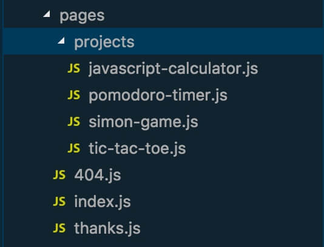
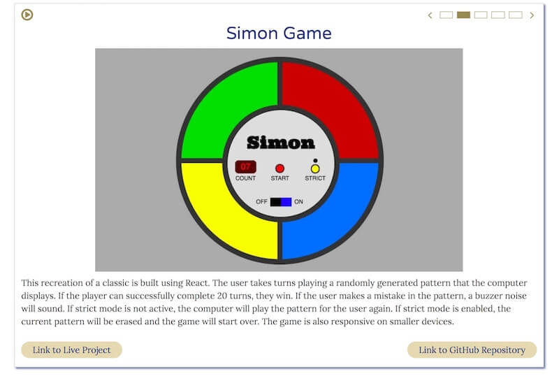

> Imagination is the living power and prime agent of all human perception.
> 
> ~Samuel Taylor Coleridge

I am so excited to announce that the redesign of my portfolio and blog is finally live after going back to to the conceptual drawing board and rebuilding it from the ground up. It has been an exciting journey to implement new development and design concepts that I have picked up since May 2017 when I built the first version of the site. At the time, it was the first full site that I had put together, and was substantially more involved than the relatively small projects I had done to that point. Since then I worked on more complex applications, built a [full stack travel application](/blog/the-journey-to-creating-wanderful) with a team of two other developers, and dove headfirst into React.

The previous version of the site was built using Jekyll as a static site generator. This was great at the time as it was fairly easy to pick up with a plethora of documentation and tutorial videos for times when I got stuck.  It also fit in well for my early learning steps of JavaScript. I sprinkled in some amounts of JavaScript for a modal window in a later iteration and used jQuery for some of the page animations. I was able to continue adding onto it fairly well,  but was hitting a couple pain points with the process. First, I hosted the project on Github, which was great in that it would rebuild the site when I pushed changes to the master branch. One of the major downsides was lack of customizability in the build process and plugins utilized, as Github restricts all but the core ‘safe’ Jekyll plugins. There were ways around this, such as building the site locally and committing the build folder, but I didn’t like the tradeoffs they offered. I set out to resolve these pain points as well as update my portfolio to better represent my current skillset.

## Going Back to the Conceptual Drawing Board
I set off knowing what things that I liked about the current site, and exploring what I wanted to change. I knew that I wanted to build the website in React, favoring the component model of development allowing for more reusable code. I also knew that I wanted to maintain the core functionality of the site as a main page to share some information about me and my work, and a blog to document my journey as a developer/other areas of interest. As I was conceptualizing what I wanted to achieve in the redesign, several areas stuck out:

* The site needed more depth of design with some asymmetrical design thrown in. The previous iteration was far too blocky for my taste now, and while clean lacked much pizazz.
* Add interactive elements to make the website more dynamic and reactive. Apart from the modal implementation for displaying additional information on a project, there wasn’t much interactive elements on the older version and it probably wasn’t as discoverable as it should have been.
* The process for creating blog posts needed to be more streamlined. I don’t have a problem writing a blog post in Markdown and including some YAML front matter to set the title, date, tags, etc. However, I know that if I am building a site for a non-developer that this would be an unnecessary barrier for their usability and an unrealistic expectation. I wanted to experiment with building/using a CMS that would be accessible to someone who does not have a developer background.
* Experiment with different technologies. Initially, I planned to look into CSS in JS and unit testing. I did implement these, but also utilized many other new technologies, libraries, and patterns including: CSS Grid, GraphQL, HammerJS (for touch input) , creating custom React Scroll components, and creating my first higher order component.

I decided to use [Gatsby](https://gatsbyjs.org) as a build tool for the redesign after hearing good things about it from developers that I follow, and it’s ability to integrate well with a multitude of CMS options. Gatsby is a static site generator similar to Jekyll, but has several distinctions. When creating a Jekyll site you write the code using HTML and Vanilla JavaScript; Gatsby uses React at its core and all of the pages, templates, layouts, etcetera are written in React. Given my affinity for React it was an easy sell. To create a page, a component that renders all of the content you want on a specific page is created within the `/pages/` directory. On build, Gatsby creates static html files and assets for each route.  



## Setting up a blog

Gatsby also exposes a lot of configurability with the page creation, paths and data provided through a Node configuration file. One of the areas that this really shines is the built in integration with GraphQL and setting up a blog. Gatsby has plugins for supporting various means of getting your content into the application whether through the Markdown and YAML method I had used previously or a selection of CMS options such as Wordpress and Contentful. When the appropriate plugin is installed and configured, it also configures related GraphQL endpoints to be able to query your data to create the posts and pages when you start up the server or build the application. You don’t need to manually create a page for each blog post. You can also configure what data you want to retrieve and pass to each page, as well as setting up the slug for each page. Many examples provided will have a slug/path field that is filled out by the person writing the post/page. This did not align with the guiding principle of creating a site which would have easily maintainable content by someone who is not a developer. I was able to circumvent this and automatically create the slug for each path with a function that accepts the post date and title and returns a nicely formatted slug. 

```javascript
const slugify = require('slugify');

exports.postSlug = (date, title) => {
  const titleSlug = slugify(title, {
    remove: /[^A-Za-z0-9\s]+/,
    lower: true
  });
  return `blog/${date}/${titleSlug}`;
};
```

For the management of the posts and their content, I decided to try [Contentful](https://www.contentful.com) which has a generous free plan[^1] and a nice visual interface. You can create multiple content models depending on your needs (eg. Blog post and author models). Within each model, various fields can be created, declared as required, undergo validation, reference other content models, etc. Additionally, assets such as PDFs, images, documents, and more can be added and linked to a particular entry. To create my blog model most of the fields were text fields, with the post categories and tags utilizing checkbox validation. I also utilized an optional media content type which sets the headline image of a particular blog post if desired. After an instance of a particular content model is created it can be stored as a draft for later review, edited, deleted, or published to be accessible to the API calls. There are various user levels that can be set to only allow certain behaviors, but I did not explore that.

```
{
  allContentfulBlogPost(limit: 500, sort: { fields: [postDate], order: DESC }) {
    edges {
      node {
        id
        title
        postDate(formatString: "YYYY/MM/DD")
        body {
          childMarkdownRemark {
            html
          }
        }
        headlineImage {
          description
          file {
            url
          }
        }
      }
    }
  }
}
```

Once the data structure is created within Contentful it can be queried against within Gatsby using GraphQL. [GraphQL](http://graphql.org/) is a querying language developed by Facebook which has some distinct advantages over traditional REST API endpoints. One advantage that shined through in this particular project is the ability to query only the data that each component needs. Need just the title and postDate (which can have the string formatted to a specific pattern before being returned) so that slugs can be generated? Just request those fields. Want to filter all of the data to only the instances that match a specific filter? You can do that as well, and then select the data you want to return for each of those results. I only touched the surface of this powerful tool, and am amazed at the potential. I do have plans to do some further work with GraphQL to enable filtering posts by specific category or tags. The data is already in the model, but the functionality still needs to be built out. Working with GraphQL does take a bit getting used to, but Gatsby also ships with an excellent tool called GraphiQL on the development server which provides autocomplete suggestions and allows you to test and format your queries until you have exactly what you need. This was instrumental in learning how to structure the queries and to make sure that you are getting the data back that you are expecting. If you have previous experience working with databases, it likely will come easier to you; I recognized several pattern similarities between MongoDB and GraphQL that helped me to pick it up.

## Creating a Better Design
The design approach for the previous iteration was minimalistic for a couple reasons. First, I like that style generally and also enjoyed the monochromatic color scheme. Secondly, I’m not a designer and it was also my first full site layout. After some additional experience building projects, and gaining a better handle on CSS I knew that I could do better. My main goals for the design were threefold: 1) introduce some more asymmetrical components to make it less block-like, 2) create and utilize dynamic elements to bring more life to the page and increase user interaction, and 3) utilize a more dynamic color palette to provide additional depth. 



Even in the early stages of the planning, I knew that I wanted to substantially change how I was displaying my projects. Having a grid of screenshots with no other indication and limited discoverability that they could be clicked to get more information and links to the live versions and codebases was not a good way to properly showcase my skills. There was a decent quantity of projects, but the presentation left a lot to be desired. I knew that I wanted to have a lot of the details and links for each project up front and center, as well as use larger images. The projects needed to be showcased, not squashed into a grid of images with limited context. In my desire to display most of my projects, I overemphasized quantity over presentational quality. This imbalance needed to be rectified in order to properly display my projects. I set out to create a showcase component which would show a lot of the information previously displayed in the modal dialog, but be rendered directly onto the screen. Due to space considerations, and wanting to keep the site fairly compact I didn’t want to duplicate this component for each project. I created a carousel which would automatically cycle through a list of projects and change the presentational data on a set interval. The user is able to play and pause the carousel at any time or manually change which project is being displayed. The construction of this larger component also helped me to increase my awareness and skillset in areas of accessibility, and maintaining feature parity on both mobile and desktop as described [here](/blog/100daysofcode-round-2-weeks-3-and-4).

Adding some additional depth and asymmetrical design meant that I finally needed to dive into CSS Grid to explore different and more creative layout possibilities. The About section seemed a prime place to experiment with this as none of the areas needed a substantial amount of space by themselves, and clumping them together in blocks would be beyond boring. After familiarizing myself with Grid via some tutorials I set off trying different combinations of layouts, ever thankful for the ability to change CSS declarations in the Developer Tools. To help fill out the space, and provide a nice personal touch I added a quote slideshow with some of my favorite quotes to this section as well. CSS Grid is an amazing tool, and I am so excited to explore it further and in more depth. I cannot imagine trying to create layouts like this previously and with the ease that comes with Grid. Making the design responsive is also a breeze, by changing the grid areas each asset is assigned to according to media queries. 

Another area that I was able to add some more depth of the content was with the creation of a Card component that acts as a presentational wrapper for the content it holds. The Card component is used throughout the site and adds depth through a thin border line and drop shadow around the container, and helps the section to stand out and provide definition amongst what could otherwise be a sea of text. I intentionally kept the component flexible and solely focused on maintaining this visual presentation with some prop flags so that it was reusable on many different components such as the random quotes, skills, Portfolio Carousel, and Contact form.

## Final Thoughts
Rebuilding the site from the ground up was a very valuable experience for me both to start anew and to create a larger project utilizing my current skill and tool sets. I came out of the process with a substantially better website and also many new skills as well. Another key area that helped to improve my skills as a developer was finally jumping on the ESLint train. It helped to identify ways that I could improve my code in terms of functionality and more importantly identify areas where my code needed to be more accessible. Whenever I didn’t understand a rule that was being flagged, I was able to read up on their documentation about the rule, which provides a great description of the rule as well as code examples that will pass or fail the rule. If you are a JavaScript Developer and are not using ESLInt yet, I highly recommend that you [check it out](https://eslint.org/). It can be run on the command line and can also integrate into the major code editors to show you an output log and visual highlighting on the file as you are working on it.

From here, I have continued working on some fine tweaks to the site and have moved on to learning React Native. I’m excited about the possibility of extending similar concepts found in React to be able to produce Native mobile apps. I have had a couple larger project ideas that could be really interesting mobile applications as well. 

[^1]: At the time of writing, the free plan allows users to have 2 spaces, 10,000 records, 1 million API calls per month, and 1 TB of asset data transferred from their CDN per month. This is in exchange for displaying a word mark in the footer of the website. If this word mark is not desired, a similar plan without the word mark can be purchased for $39 per month.
