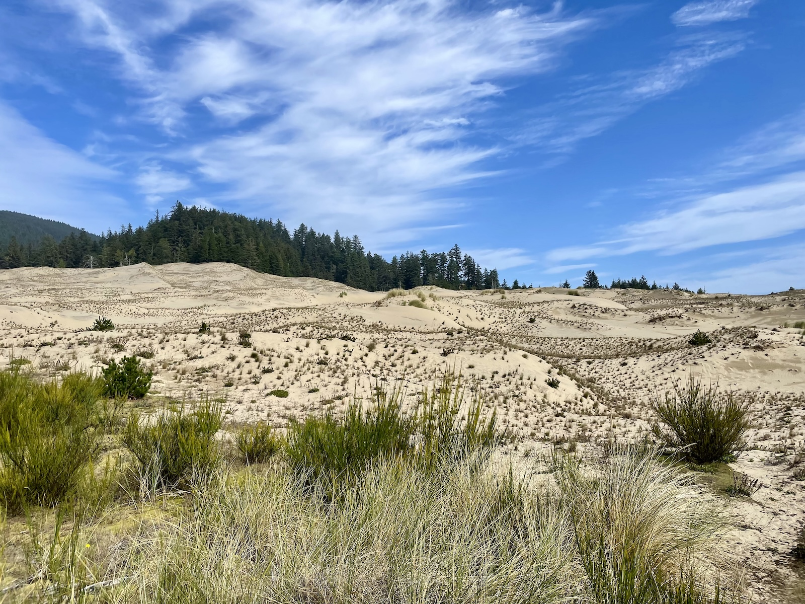
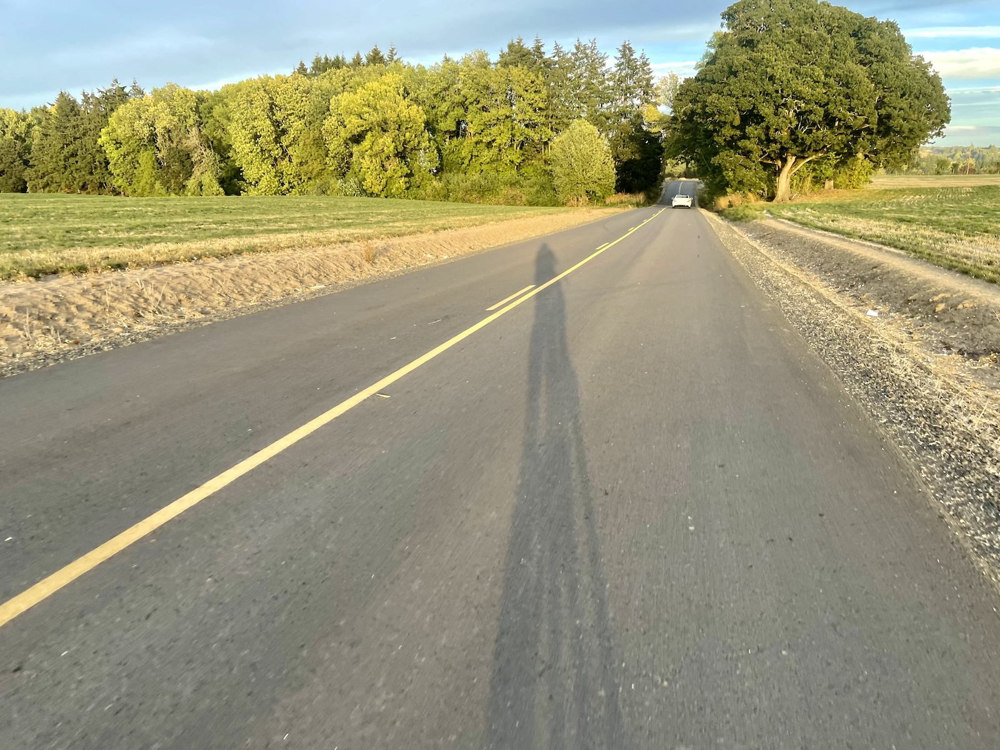
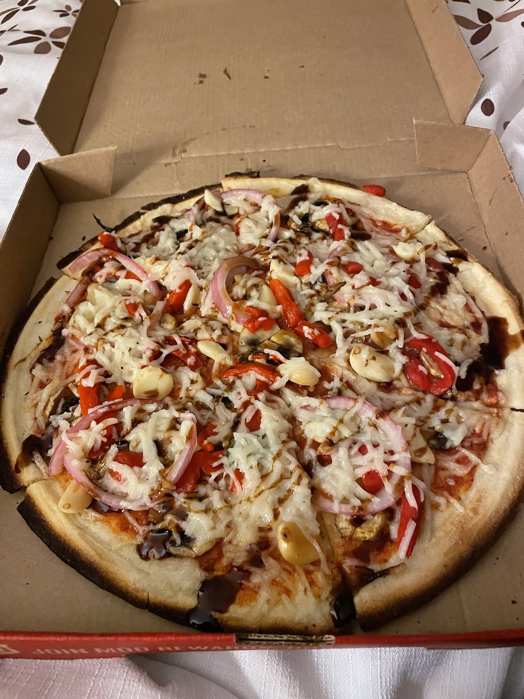

My cycling goals this year have revolved around a theme of trying new things and pushing myself in ways that had been relegated to the maybe some day category. This has included exploring gravel riding, racing, and ultra endurance. A few weeks ago I completed my third ultra endurance ride. I completed two 200km rides in the summer, but this was the first attempt at 300km. I've also longed to ride out to the Coast from Portland metro for years, but it always seemed out of reach. As Autumn rolled in and the days have already started getting shorter, I knew I had to commit now or face an increasing amount of time in the dark, and a higher chance of substantial rain. I enjoy riding in the dark hours and the rain, but those weren't variables I wanted at play with such a large increase in distance and total elevation.

Packing all of the required food and supplies was a challenge in itself. I wanted to travel light, utilizing a hydration pack for extra water capacity and some storage, and a top tube bag. In retrospect I probably should have added the handlebar bag as well for some extra storage. I'm both gluten free and vegan which can make finding food while traveling or riding a supported event challenging. I always pack at least 80% of the nutrition I'll need on me, because I can't count on what I'll have access to along the way. With an estimated 8,200 calorie burn for the day, I needed to pack around 5,500 calories. At least my gear weight would progressively go down as I went through all that food. 😆



##  Venturing towards the Coast

The route started in Forest Grove, about a 2 hour transit ride from Portland. I was planning for a 14 hour moving time ride with about 2 hours of stoppage. My goal was to be on the road by 5 AM and back by about 9 PM. I rolled up to the hotel around 8:45PM Friday evening, checked in, and laid out everything for a 3:45 AM start to the day. The start of the ride was stunning. It didn't take long to get out of the small town and be surrounded by farmland illuminated by the moon and stars. Even though it was early and cold, it set a positive tone for the start of the ride. I ended up missing a road closed sign and added an extra 6km or so off the bat, but I was so thrilled to finally ride to the Coast to be phased by it.

The first 90km of the ride were simultaneously the least pleasant and also striking. The route took Highway 6 out to the Coast which is a main path for cars traveling out to Tillamook, OR. There is a small shoulder, and drivers were pretty good as far as giving space while passing. However, the rush of an air pocket as large trucks pass is still startling and destabilizing even with some space. The early start helped mitigate some of this, and I knew that the rest of the route would have less traffic. Riding through the Tillamook Forest in the hours just past dawn was magical. I could see the sun starting to hit the canopy line, and layers of fog amongst the trees. The Autumnal transformation of deciduous plants has begun, which is interspersed amongst the evergreen trees. This is a big reason why Autumn is one of my favorite seasons in the Pacific Northwest. As I was descending from the summit and into the rolling hills, I had to pull off and admire the scene of the dynamic road amidst the changing seasons and dissipating fog. This is something I could never do in a car. There was a bit wider of a shoulder at this section for me to pull off, but was nowhere near wide enough for a car. I waited for a few minutes to admire the scene and to have a car free shot, before continuing my rolling hill descent into Tillamook.

## The Beauty of the Coast and Crossing of Paths

The time in Tillamook was short before riding along the bay towards the first of three capes along the coast. Cape Meares came up first and brought the fury of steep climbs with it. 😅 It averaged 7.8% gradient for 2.8km, jumping up to 14.3% in some sections. Cape Meares is one of my favorite lookout points along the coast. It highlights the beauty of the forest coming up to the coastline to be met with beautiful cliffside views of the powerful ocean below. My 3 year long goal of cycling to the coast was now a reality. I stood there for 10 minutes taking in the scenery while slightly shocked at what I had already accomplished for the day.


<!-- TODO: Sort out align center class-->

The Climb up to Cape Meares

The next several hours continued along the windy coastal roads that are part of the [Oregon Coast Bike Route](https://traveloregon.com/things-to-do/outdoor-recreation/bicycling/ride-oregon-coast/). I'd love to ride more of the coastal route at some point, but spending a long time on the coastal highway doesn't sound like a relaxing time either. I started developing the first signs of growing discomfort which would turn into a much larger issue as the ride progressed. The decline of my body's tolerance to my saddle has been growing over the past couple months. I'm sure it is a combination of body changes, the saddle hitting end of life, and my riding style moving more aggressive. I developed hot spots that required more standing pedal breaks to relieve pressure points. Ultra endurance brings out all the small fit issues and amplifies them by orders of magnitude. By the time I hit Pacific City and the final cape, I had to get off the bike and take a longer break.

Pacific City was the halfway point of this adventure. I had covered 155km over the past 8 hours and was doing well with my expected pacing, nutrition, and spirits. I found some desperately needed coffee, took it outside, and proceeded to collapse on the patio, giving muscles and feet a moment of respite. As I was heading to the market for some supplies, I encountered a couple who was bikepacking their way from Vancouver, BC down to LA. We had some brief and wonderful conversations about our respective adventures and appreciation of experiencing the world via bike. It was amazing to hear how their months long trip had already gone and sharing our experiences viewing the capes earlier that day. This and the extended break provided a good chance to recenter and ground myself for the next half of the ride, heading back inland. I had no idea how much I would need that until much later.

## Terrifying Noises from a Bike are Never Fun

The next 8 hours got progressively harder, and the larger mental blocks were yet to come flying at me. The route back inland followed Little Nestucca Highway; a picturesque winding road through the forest and following a creek. It had lots of pretty bridges as an added bonus! Shortly after I crested one of the rolling hills, I suddenly hear a horrible pinging noise followed by a terrifying high repetition clanking. I've never had something on the bike sound this terrible. I was able to quickly slow down and pull to the side of the road to find a rear spoke snapped at the j bend and hitting several of the other spokes. I still have no idea why it failed. I tucked the broken spoke towards the hub and gave the wheel a spin. It definitely had a wobble, but wasn't horrible. I've ridden worse out of true alloy wheels before. I checked all the remaining spokes and confirmed they were secure. So I found myself in the middle of the forest—at kilometer 174 and without cell service—deciding what was the best and safest option.

After some pondering and test riding for 200m sections at a time, I decided the wheel was solid enough to ride, but I would need to check it semi-frequently to make sure the other spokes didn't start to de-tension. For the rest of the ride, I had an additional mental game of trying to convince myself if the wheel trueness had degraded or remained stable. That's not a fun task as fatigue continues to mount. I was able to get out an Inreach message to folx who were monitoring my ride and let them know that I may need to bail, but I was going to continue for the time being. The rest of the ride along the river was beautiful, even with this complication and my growing saddle discomfort. There's something about the forest that enchants me in ways I can't describe.

## Why am I Doing this Again? The Mental Walls Grow

I emerged from the woods, rolling into Grand Ronde and the final 60km. The mental wall I knew was coming hit hard. By this point my increasing saddle discomfort was pretty painful and required standing breaks every 15-20 minutes. My posture began to suffer as a result, and I knew the shoulder discomfort would follow suit. I kept reminding myself that I could manage and have worked through greater discomfort. While the issues were painful, they weren't a safety concern. I found a convenience store to collapse on the sidewalk while refueling carbs and caffeine with a Coke. The open in case of emergency bone conducting headphones finally emerged from my pack to serve their morale boosting role. On every ultra endurance ride I've done, I hit a point where I just want to give up and ask why I'm even doing this. I have to switch away from my main data screen to avoid counting down each kilometer. My AuDHD enhances these loops and makes them incredibly hard to break out of. The headphones provide some different input mechanisms and dopamine sources to help me push through these mental barricades. I don't allow myself to pull them out until this wall eventually comes. The novelty of the change is essential to its impact.

The final 20% of the ride became a mental blur. The time for sightseeing was largely over and my focus became finishing. A much needed tailwind helped provide some motivation boosts—though it was much less pleasant as a crosswind, trying to push me into the road at 20kph. As I rolled into Dayton and Amity, the daylight quickly fading, I knew I was in the homestretch. My first 200km gravel ride included stops in these towns. The mental blocks were manageable again, but my saddle and ankle pain had become a persistent issue. I took another sugar and caffeine break, checking in with my body and preparing myself and gear for the dark rural riding in the final 2-3 hours.

## One Final and Sudden Surprise

Pain and determination sum up the last 35km. Everything hurt, but I was still within my safety boundaries and the wheel was holding up. I had to get up or I wouldn't get moving again. The sunset across the farmland was beautiful, and I started getting a third wind seeing the moonrise and enjoying the serene roads under the stars. I have a strong affinity towards the moon and the beauty of her shifting presentation. Friends started checking in with me more regularly to see how it was going, and were surprised/amazed that I was still moving. Standing breaks became every 10 minutes and my ankle was getting worse. One hour to go. The best option is to nurse my way to the finish. As I slowed down for a turn, everything suddenly went dark.

Having a headlight suddenly turn off around 9 PM on a rural road with no supplemental lighting is an experience I'd rather not experience again. Earlier in the day, I made the call to only charge the rear light during the day. The headlight said I would have enough run time for the evening hours. I don't know if I misremembered the amount, didn't account for going at a slower pace, or what happened. Whatever the reason, that's not a mistake I'll repeat again and I suddenly had to figure out how to get into the small town safely with no headlight. I tried plugging the light into the battery pack and waiting 5 minutes. It flickered on and then immediately off. If the light was able to support being on and charging simultaneously, it was too far drained to be an option. So a functional headlight wasn't an option, but I still needed to get back safely. The high viz vest would help drivers see me, but I wouldn't be able to safely see where I was going. Thankfully, I packed a small pocket light in case I needed to search through my bag in the dark. I pulled that out, and switched it to the brighter setting to provide enough light for the final 30 minutes.

I had been moving on the bike for more than 13 hours and now had to juggle holding a pocket light while managing the last bit of fatigue. In an odd way, managing the flashlight did help distract from my body aches a bit. Or maybe I was so exhausted and focused on making it to the hotel so I could shower and sleep. At almost 10 PM, I pulled into the finish. Over 16.5 total hours, I had covered 311.6km and 2,628m of elevation. My estimates were almost spot on. My moving time ended up being shorter than anticipated at 13.5 hours, but my static time was slightly longer. I road back to the hotel, limping my way up the stairs, as I let people know I was back safe. Thankfully, Mod pizza was open until 11 and walking distance from my hotel room. Shower. Pizza. Allow exhaustion and sleep to take over.

## Sorting through the Aftermath

It's been several weeks since this epic adventure. My leg pain and soreness stuck around for a day or two. Any amount of squatting for tasks was uncomfortable. The ankle is another story as the ride aggravated a prior injury. It has demanded some more time off the bike as well as physical therapy exercises to recuperate. It's still a work in progress, but I've been able to start adding in a bit more riding volume over the past week. The biggest practical take aways from this ride were the necessity to replace my saddle and then dial any remaining bike fit issues in. In retrospect, this issue was likely a significant factor in the cascading physical issues that followed. I definitely won't skip charging the headlight during the day again either. I've already started testing out a new saddle that seems to be working out much better for the 2-4 hour rides it has seen so far.

As Autumn sets in and my training volume starts to taper, I'm already planning goals for next year. Ultra endurance continues to be a source of intrigue luring me in. I continue to be amazed at what my body is capable of. There's a lot of discomfort and mental barriers on ultra endurance rides, but overcoming these obstacles is also healing in many ways. Anecdotally, the high correlation between endurance athletes and those who have overcome trauma resonates with me in many ways which I may share at a high level in the future. I would definitely do a 300km ride again, and maybe try out a 400km ride after I successfully complete a few more 300km ones. One of my goals for 2025 is successfully completing the Swift Summit 200 mile (320km) course. I'm on the right track!
